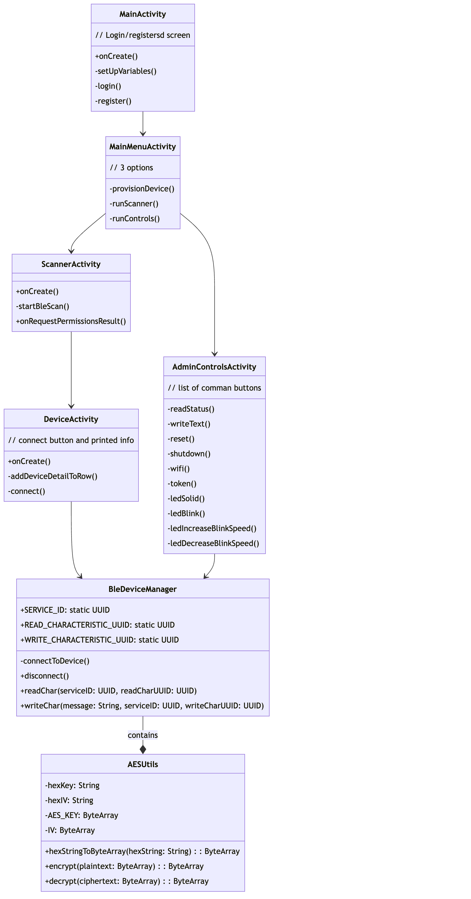

# SafePiConnect
This is the android application for the ***SafePi*** project. This application communicates with the SafPi device over Bluetooth Low Energy (BLE) as well as with ***SafePiWeb***. It's main functionality is to register new users, and provision new ***SafePi*** devices, but it also implements a BLE Scanner for connecting and viewing other devices in the users proximity. 

---
## Features:
SafePiConnet comes fully stocked with an advanced BLE scanner for scanning and connecting to devices, a packet sniffer for analyzing BLE traffic, and a suite of device controls for the SafePi device. It will also include a status window for you remotely connected devices. 

## Figures:
SafePiConnect Class Diagram

TODO: 
- Structure UI with proper activities and interfacing.
- Implement login/registration screen.
- Implement controls menu. 
- Expand the scanner with more device information, and the ability to connect.

### Test User
POST  https://localhost/create_user HTTP/1.1
content-type: application/json
{
    "email":"test@test.com",
    "password":"TheWorstPasswor1209",
    "isLocked":"true"
}