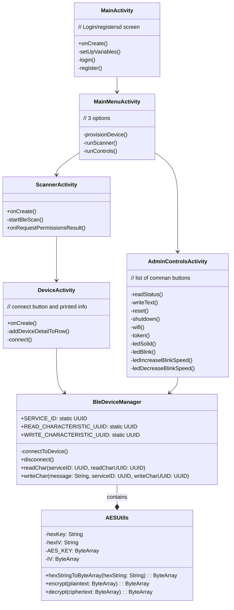

```mermaid
classDiagram
    class MainActivity{
        // Login/registersd screen
        +onCreate()
        -setUpVariables()
        -login()
        -register()
    }
    class MainMenuActivity {
        // 3 options
        -provisionDevice()
        -runScanner()
        -runControls()
    }
    class ScannerActivity {
        +onCreate()
        -startBleScan()
        +onRequestPermissionsResult()
    }
    class DeviceActivity {
        // connect button and printed info
        +onCreate()
        -addDeviceDetailToRow()
        -connect()
    }
    class AdminControlsActivity{
        // list of comman buttons
        -readStatus()
        -writeText()
        -reset()
        -shutdown()
        -wifi()
        -token()
        -ledSolid()
        -ledBlink()
        -ledIncreaseBlinkSpeed()
        -ledDecreaseBlinkSpeed()
    }
    class BleDeviceManager {
        +SERVICE_ID: static UUID
        +READ_CHARACTERISTIC_UUID: static UUID
        +WRITE_CHARACTERISTIC_UUID: static UUID
        -connectToDevice()
        +disconnect()
        +readChar(serviceID: UUID, readCharUUID: UUID)
        +writeChar(message: String, serviceID: UUID, writeCharUUID: UUID)
    }
    class AESUtils {
        -hexKey: String
        -hexIV: String
        -AES_KEY: ByteArray
        -IV: ByteArray
        +hexStringToByteArray(hexString: String): ByteArray
        +encrypt(plaintext: ByteArray): ByteArray
        +decrypt(ciphertext: ByteArray): ByteArray
    }
    
    ScannerActivity --> DeviceActivity
    DeviceActivity --> BleDeviceManager
    MainActivity --> MainMenuActivity
    MainMenuActivity --> ScannerActivity
    MainMenuActivity --> AdminControlsActivity
    BleDeviceManager --* AESUtils : contains
    AdminControlsActivity --> BleDeviceManager

```